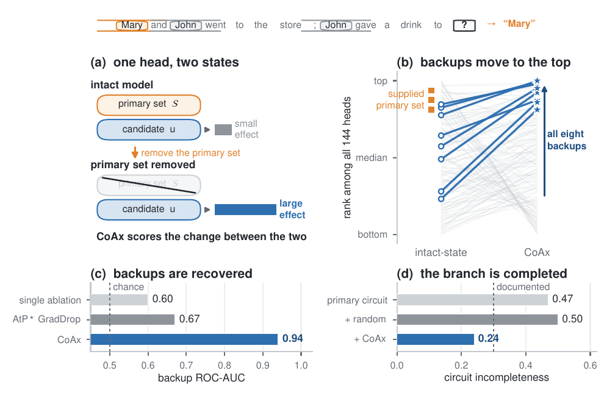

<div align="center">

# Conditional Co-Ablation (CoAx)

### Recovering Self-Repair Backups in Transformer Circuits

[](https://arxiv.org/abs/2607.01940)
[](https://gongzhiren.github.io/Conditional-Co-Ablation-website)
[](LICENSE)
[](https://www.python.org)
[](REPRODUCIBILITY.md)
[](https://github.com/GongZhiren/Conditional-Co-Ablation/actions/workflows/release-check.yml)
[](https://colab.research.google.com/github/GongZhiren/Conditional-Co-Ablation/blob/main/notebooks/coax_quickstart.ipynb)

**CoAx measures how much a component's ablation effect grows after a supplied
primary circuit is removed. It is a forward-only, label-free way to recover
dormant components that become load-bearing under intervention.**

[Overview](#method) · [When to use CoAx](#when-to-use-coax) · [Quick start](#quick-start) · [Reproduce](#reproducing-the-core-paper-results) · [Models](#model-registry) · [Troubleshooting](#troubleshooting)

</div>

<p align="center">
  
</p>

<p align="center"><em>Figure 1. CoAx exposes dormant backup components after primary-circuit removal and uses them to complete the causal account.</em></p>

## News

- **August 2026 — expanded CoAx and experiments.** We further developed CoAx
  with causal freezing, circuit completion and knockout, mechanism-matched
  intervention panels, and held-out completion across model families. See the
  latest [arXiv version](https://arxiv.org/abs/2607.01940) for the full study.
- **August 2026 — improved open-source implementation.** The codebase now offers
  a cleaner installable package, a guided visual quickstart, portable public
  model configuration, structured experiment artifacts, resumable long runs,
  and streamlined reproduction commands.
- **July 2026 — initial release.** Reference implementation for the first arXiv
  version.

## Method

For candidate unit `u` and supplied primary set `S`, CoAx compares the candidate's
ablation effect in two states:

```text
comp_u(S) = E(delta_z[u | S removed]) - E(delta_z[u | intact])
```

`E` is the centered Fisher energy defined by the clean output distribution. A
positive score means that removing `S` increases the magnitude of `u`'s causal
effect. The clean distribution and, when requested, the clean top-r support are
fixed across all interventions.

On GPT-2-small IOI, the paper protocol uses 96 prompts at the answer position,
the full 50,257-token vocabulary, zero ablation, and prompt seeds `1 15 22 8`.
The three documented name-mover heads are supplied as `S`; the eight documented
backup name-movers are used only to evaluate the resulting ranking.

## When to use CoAx

CoAx complements a supplied primary circuit: it asks what becomes important
after that circuit is removed, rather than replacing primary-circuit discovery.

| Research question | Suggested approach |
|---|---|
| Which components support the intact computation? | Attribution patching, EAP, or activation patching |
| Is a supplied circuit incomplete because of redundancy or self-repair? | **CoAx** |
| Which dormant components complete a supplied primary circuit? | **CoAx**, followed by causal validation |
| What is the edge-level computation graph? | Edge-level circuit discovery such as EAP or ACDC |
| Do the recovered backups actually carry repair? | Conditional freezing, knockout, or patching |

## Installation

```bash
git clone https://github.com/GongZhiren/Conditional-Co-Ablation.git
cd Conditional-Co-Ablation
python -m venv .venv
source .venv/bin/activate
python -m pip install --upgrade pip
python -m pip install -e .
```

`requirements.txt` gives supported version ranges. `requirements-tested.txt`
records the exact Python package versions used for release smoke checks; choose
the PyTorch wheel matching your CPU/CUDA platform.

Models are downloaded by Transformers on first use and cached by Hugging Face.
For gated checkpoints (Gemma and Llama), accept the model license and authenticate
with `hf auth login`. Set `HF_HOME` if the cache should live outside its default
location. No checkpoint, cache, or machine-specific path is committed here.

## Quick start

The [Colab quickstart](https://colab.research.google.com/github/GongZhiren/Conditional-Co-Ablation/blob/main/notebooks/coax_quickstart.ipynb)
runs the reduced GPT-2-small experiment and turns its JSON artifact into head
rankings and 12 × 12 score maps. No local setup is required beyond a Google
Colab runtime.

This reduced run checks the complete forward-only path. It is not the paper
protocol and should not be compared with reported numbers.

```bash
make check
make smoke
```

For an existing offline checkpoint, override only the model path; no source or
configuration edit is needed:

```bash
make smoke MODEL_PATH=/path/to/gpt2-small
```

The smoke test uses 8 prompts and a 192-token fixed support. It checks loading,
hooks, interventions, ranking, and JSON serialization; it is deliberately not a
paper-number run.

## Key results

On GPT-2-small IOI, CoAx substantially improves recovery of the documented
backup branch over intact-state and removed-state alternatives:

| Selector | Backup ROC-AUC |
|---|---:|
| **CoAx** | **0.941 ± 0.004** |
| AtP\* GradDrop | 0.815 ± 0.031 |
| Conditional energy | 0.758 ± 0.004 |
| EAP-IG | 0.700 ± 0.020 |
| Single ablation | 0.603 ± 0.007 |

The same label-free selection is causally load-bearing: freezing the selected
heads causes an IOI-margin loss of `0.90 ± 0.07`. Used as a circuit completion,
it reduces incompleteness from `0.755 ± 0.074` to `0.205 ± 0.030`; its knockout
also gives the closest general-selector match to the documented backup
intervention. Across the mechanism-matched panel, CoAx is positive in `11/12`
instances and all `4/4` mechanism clusters, with macro Spearman `0.123` and a
nested 95% interval of `[0.047, 0.201]`. Machine-readable paper values and exact commands live in
[`results/reference_metrics.json`](results/reference_metrics.json).

## Reproducing the core paper results

Run commands from the repository root. Editable installation makes `src/`
available without machine-specific path exports. Defaults below are
the paper settings unless a command explicitly says otherwise. Generated files
are written under `outputs/coablation/` and are ignored by Git.

| Target | Result produced | Default scale |
|---|---|---|
| `make headline` | backup recovery and principal baselines | GPT-2-small, 4 × 96 prompts |
| `make mechanism` | graded wake-up and DLA hand-off | GPT-2-small, 4 × 96 prompts |
| `make causal` | activation-freezing causal validation | GPT-2-small, 4 × 96 prompts |
| `make completion` | raw-ranking circuit completion | GPT-2-small, 4 × 96 prompts |
| `make knockout` | distance to documented backup intervention | GPT-2-small, 4 × 96 prompts |
| `make panel` | mechanism-matched hierarchical intervention panel | 3 templates × 4 mechanisms |
| `make cross-model MODEL_KEY=pythia-410m` | disjoint induction completion | 32/16/64 split |

### 1. Backup recovery on GPT-2-small

```bash
python experiments/paper/backup_recovery_full.py \
  --model-key gpt2-small --num-prompts 96 --seeds 1 15 22 8 \
  --position-mode last --top-r 0
```

This produces the per-head rankings and baseline metrics used for the headline
backup-recovery table. `--top-r 0` means full vocabulary. The headline values
are CoAx ROC-AUC `0.941 ± 0.004`, single-ablation `0.603 ± 0.007`,
conditional energy `0.758 ± 0.004`, and AtP* GradDrop `0.815 ± 0.031`.

### 2. Causal hand-off and freezing

```bash
make mechanism
make causal
```

These runs test the graded wake-up, direct-logit hand-off, and whether freezing
each selector's chosen heads at their intact outputs removes repair. The
mechanism target runs all four paper seeds and writes both per-seed artifacts and
an aggregate summary; the CoAx top-8 is selected once per seed and held fixed
throughout the primary-removal sweep.

### 3. Circuit completion and knockout

```bash
python experiments/paper/circuit_completion.py \
  --model-key gpt2-small --num-prompts 96 --seeds 1 15 22 8 --top-r 0

python experiments/paper/knockout_oracle_distance.py \
  --model-key gpt2-small --num-prompts 96 --seeds 1 15 22 8
```

Completion uses complement mean ablation and measures whether the completed
circuit reproduces the full model's response to primary removal. Knockout is
judged by distance to the documented backup intervention, not by maximizing task
damage.

### 4. Mechanism-matched intervention panel

```bash
make panel
```

The panel evaluates three prompt templates and four supplied primary mechanisms.
Each instance is scored against its mechanism-matched repair target: IOI margin
for name-mover and S-inhibition seeds, and repeated-token induction log-probability
for induction and duplicate-token seeds. The run checkpoints every completed
instance; rerunning the same command resumes safely after interruption.

### 5. Held-out cross-model generalization

```bash
python experiments/paper/cross_model_completion.py \
  --model-key pythia-410m --n-detect 32 --n-calib 16 --n-eval 64 --topk 10
```

Cross-model completion uses disjoint detection, calibration, and evaluation
splits. Repeat it for the model keys in
`configs/model.yaml`; larger gated models require their corresponding licenses
and suitable GPU memory. `--skip-grad` is useful for a fast CoAx-only check, but
omits AtP/AtP* and therefore does **not** reproduce the complete paper table.

## Reproducibility notes

- Model weights are frozen; no training, fine-tuning, or optimizer is used.
- IOI prompts and repeated-token induction sequences are generated procedurally
  from fixed seeds. Backup labels never enter CoAx scoring.
- The headline IOI experiment is CPU-compatible, though gradient baselines are
  substantially slower. Cross-model runs should use a GPU.
- `--top-r 0` selects the full vocabulary. A positive `--top-r` enables the
  fixed-clean-support approximation and changes the protocol.
- CUDA kernels and library versions can introduce small floating-point changes.
  Compare rounded aggregate metrics and retain the generated JSON metadata.

## Model registry

The public registry uses canonical Hugging Face IDs, never workstation paths.
All checkpoints are frozen. Qwen2.5-7B and Llama-3.1-8B use the public Instruct
checkpoints listed below; experiments operate directly on generated token
sequences and do not apply a chat template.

| Key | Public checkpoint | Dtype | Cross-model support |
|---|---|---|---:|
| `gpt2-small` | `gpt2` | float32 | full vocabulary |
| `gpt2-medium` | `gpt2-medium` | float32 | full vocabulary |
| `gpt2-large` | `gpt2-large` | float32 | full vocabulary |
| `pythia-160m` | `EleutherAI/pythia-160m` | float32 | full vocabulary |
| `pythia-410m` | `EleutherAI/pythia-410m` | float32 | full vocabulary |
| `pythia-1.4b` | `EleutherAI/pythia-1.4b` | float32 | full vocabulary |
| `gpt-neo-1.3b` | `EleutherAI/gpt-neo-1.3B` | float32 | full vocabulary |
| `gemma-2-2b` | `google/gemma-2-2b` | bfloat16 | full vocabulary |
| `qwen2.5-7b` | `Qwen/Qwen2.5-7B-Instruct` | bfloat16 | fixed top-4096 |
| `olmo-2-7b` | `allenai/OLMo-2-1124-7B` | bfloat16 | fixed top-4096 |
| `llama-3.1-8b` | `meta-llama/Meta-Llama-3.1-8B-Instruct` | bfloat16 | fixed top-4096 |

Gemma-2-9B and Llama-2-13B remain supported configuration targets but are not
part of the principal reported panel. The reported eight-model transfer panel
uses the three Pythia checkpoints plus GPT-Neo-1.3B, Gemma-2-2B,
Qwen2.5-7B-Instruct, OLMo-2-7B, and Llama-3.1-8B-Instruct. Local mirrors can always be supplied with
`--model-path`; `configs/model.yaml` should remain portable.

## Outputs

Every entry point writes JSON under `outputs/coablation/`. Artifacts include the
protocol (model key, seeds, prompt counts, support mode), per-seed or per-instance
measurements, selected heads, and aggregate summaries. Long intervention-panel
runs checkpoint after every instance and support `--resume` with protocol
validation. Outputs are ignored by Git so a reproduction run cannot accidentally
inflate a source checkout.

## Library API

Experiment scripts are the canonical reproducibility interface, while the core
method is also importable for custom prompts and supplied primary heads:

```python
import numpy as np
from curvgraph import CoAblation, load_config, load_model_bundle

cfg = load_config("configs/default.yaml")
spec = cfg["model"]["models"]["gpt2-small"]
bundle = load_model_bundle(spec, cfg["model"]["tokenizer"])
sequences = [
    bundle.tokenizer(text, return_tensors="pt").input_ids
    for text in ["When Alice and Bob arrived, Alice gave a book to"]
]

coax = CoAblation(bundle, sequences, top_r=192, position_mode="last")
result = coax.conditional_compensation(seed_heads=[(9, 9), (10, 0), (9, 6)])
ranking = np.argsort(-np.nan_to_num(result["compensation"], nan=-np.inf))
print(ranking[:8])  # flattened head IDs: layer * num_heads + head
```

For paper comparisons, use the experiment entry points: they fix prompt
generation, candidate exclusions, controls, seeds, and evaluation labels.

## Troubleshooting

| Symptom | Likely cause | Fix |
|---|---|---|
| Checkpoint download or gated-model error | Network access or an unaccepted model license | Run `hf auth login`, accept the checkpoint license, or pass a local mirror with `--model-path` |
| CUDA out of memory | The prompt batch or vocabulary support is too large | Reduce prompts for a smoke test or use a positive `--top-r`; do not compare that approximation with full-vocabulary paper values |
| Results differ slightly | CUDA kernels, package versions, or checkpoint revisions differ | Use `requirements-tested.txt`, retain artifact metadata, and compare rounded aggregate metrics |
| Gradient baselines are unexpectedly slow | AtP/EAP baselines require backward passes | Use `--skip-grad` only for a fast CoAx check; omit it for the complete paper comparison |
| A head ID looks wrong | Flattened IDs use the model's own head count | Convert with `layer = id // num_heads` and `head = id % num_heads` |
| An intervention-panel run stopped | A long run was interrupted | Rerun the identical command with `--resume`; protocol mismatches are rejected |
| An offline-cluster run cannot find weights | The public checkpoint is unavailable locally | Set `MODEL_PATH=/absolute/checkpoint/path` for Make targets or pass `--model-path` directly |

## Repository layout

```text
configs/                 public checkpoint IDs and experiment configuration
src/curvgraph/           current CoAx implementation and intervention utilities
experiments/paper/       core paper reproduction entry points
notebooks/               run-all quickstart and visual result walkthrough
outputs/                 generated JSON artifacts (created at runtime, ignored)
```

The release intentionally excludes model weights, caches, generated experiment
logs, manuscript sources, internal diagnostics, and submission materials.

## Citation

```bibtex
@misc{gong2026conditional,
  title         = {Conditional Co-Ablation: Recovering Self-Repair Backups in Transformer Circuits},
  author        = {Gong, Zhiren and Zeng, Zihao and Wang, Yixin and Lu, He and Zhang, Yichi and Xiao, Ming and Yuen, Chau and Lim, Wei Yang Bryan},
  year          = {2026},
  eprint        = {2607.01940},
  archivePrefix = {arXiv},
  primaryClass  = {cs.LG}
}
```

## License

Released under the [MIT License](LICENSE). Model checkpoints and datasets retain
their original licenses and terms of use.
